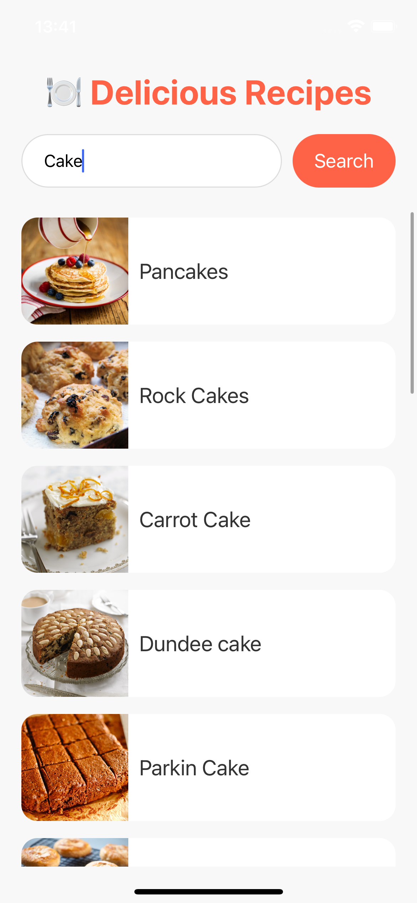
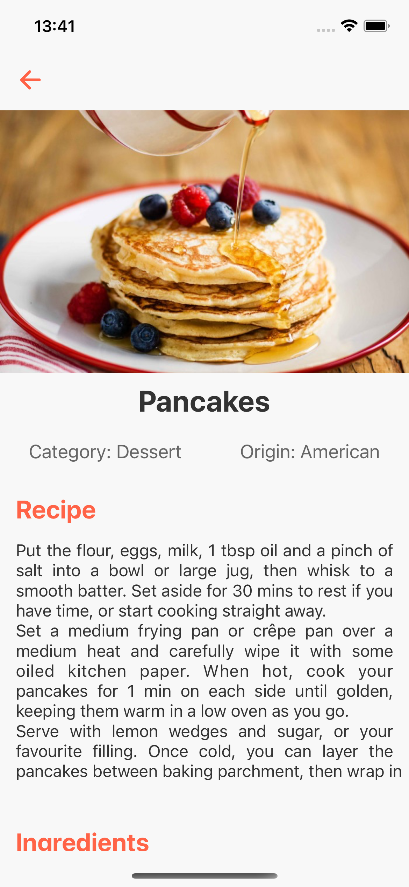

# Recipe App

Recipe App is a mobile application built with React Native and designed to help users find and explore delicious recipes. The app fetches data from **TheMealDB API**, allowing users to search for recipes by name and explore random meal suggestions. It is optimized for both iOS and Android platforms.

---

## **Features**
- Fetch random meal recipes.
- Search for recipes by name.
- View detailed recipe instructions, ingredients, and category.
- Easy-to-use interface with optimized performance.

---

## **Screenshots**
Here are some screenshots of the app:

### Home Screen


### Search Screen


### Recipe Details


---

## **Installation**
To run this app locally, follow the steps below:

### Prerequisites
- Node.js installed on your machine.
- `npm` or `yarn` installed.
- Expo CLI installed globally:
  ```bash
  npm install -g expo-cli
